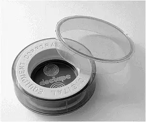
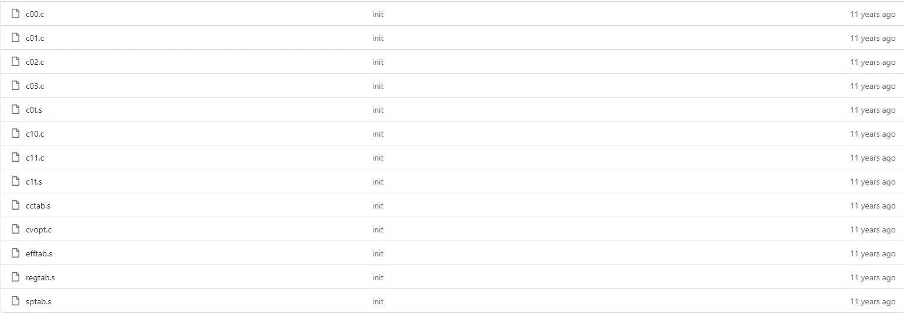
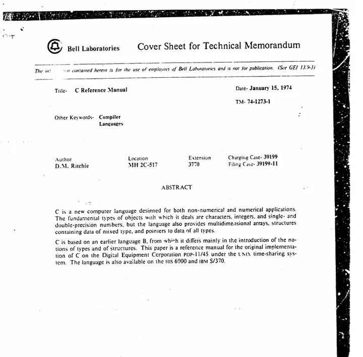
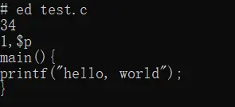
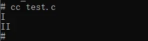
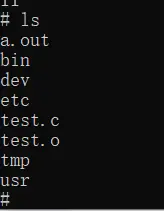
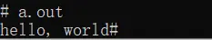
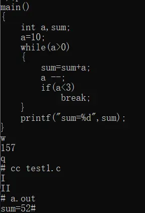

# 第一代C语言编译器

在之前的一篇文章我介绍了第一代Unix系统，其实那个系统也已经实现了第一代C语言编译器——legacy-cc。

legacy-cc这个名字是后来人取的，意味已停产的C编译器。实际上，C语言之父丹尼斯里奇真正留下来的是两卷DECTape磁带，分别标有“last1120c”和“prestruct-c”文字。后人把它文本内容导出来整理后，放在了[互联网](https://github.com/mortdeus/legacy-cc)上。



1972年至1973年，Unix操作系统才刚刚诞生，但是已经吸引了大量的用户。在使用过程中，Unix系统很不稳定，但是如果总是用汇编重构会产生大量的工作。因此，作为B语言的继承——C语言，应运而生了。在重构过程中，作为弱类型语言的C语言大放异彩。它连同[PAL-IIR](http://bitsavers.informatik.uni-stuttgart.de/pdf/dec/pdp11/dos-batch/DEC-11-ASDB-D_PAL-11R_Assembler_Programmers_Manual_May71.pdf)汇编和NB语言一起完成了后续几十年的Unix系统开发。

1978年，C语言在操作系统开发领域也取得了巨大成功。同为贝尔实验室的Brian编写了第一套C语言教程《The C Programming Language》，并面向社会推广。这个时期，C语言被称为“K&R C”（或者叫“C78”），其中“K”代表Brian Kernighan，而“R”则代表里奇。这个版本的C开始支持长整型（long）、无符号类型（unsigned）、结构体和联合体的返回类型以及枚举类型（enum）。

1989年，这本书被再版印刷，加入了很多新的C语言语法，并引入了标准库的概念。这个C语言版本变化很大，摈弃了原来的弱类型变量申明，引入了强类型语法。同年，C语言被美国国家标准协会（ANSI）纳入制定标准，所以这个版本的C语言也被称为“ANSI C”（或者叫“C89”）。这个版本的C开始支持函数原型、空指针、国际字符等。

1999年，国际标准化组织再次为C语言制定规范，这个版本的C语言叫“C99”。后续在此基础上制定出了“C11”、“C17”等众多版本。

如今，丹尼斯里奇早已作古，但世界的各个角落还运行着用C语言编写的代码。本篇文章带你穿越时光，重温第一代C语言的辉煌。

## 一、文件目录

在开头中已经讲到，如今留存下来的C语言编译器只是两卷磁带，其中“last1120c”是里奇将源码从PDP-11计算机迁移出的备份，而“prestruct-c”是结构化改造之前的备份。两者都是独立的C语言编译器的源码，所以我们只研究其中的“last1120c”。



__c00.c-c0t.s__ ：这部分文件包含了遍历源码并生成语法树为中间文件的逻辑。

__c10.c-c1t.s__ ：这部分文件包含了遍历中间文件并生成机器码的逻辑。所有文件都是文本文件。

其它文件：手动修改语法树让其能够编译成机器码。

打开这些c文件，可以看到编译这份文件的C语言语法和现在有很大区别。有的语法如今已经无法得知具体含义，但是这篇文章还是保留了部分解释。比如，用()代替{}作为结构体申明语法，用[]代替指针申明等。c文件的存在也说明那个时候C语言也已经完成自举。

而这些s文件则大多数PAL-IIR的汇编语法，只适用于当时迪吉多公司产的PDP系列机器。

## 二、语法规则

前文已经说过，最早公布的C语言语法规则已经是1978年了。C语言语法规则已经相当成熟，和今天相比已别无二致。然而，我在贝尔实验室的网站上找到了一部分当时没有公开的，写于1974年的[C语言语法文档](https://www.bell-labs.com/usr/dmr/www/cman74.pdf)。其署名是丹尼斯里奇。



根据时间，可以推出这个文档记载的C语言语法应该对应了前面的“last1120c”的C语言语法。我整理了一下和今天的C语言规则相比的不同之处——

__注释__ ：

只支持多行注释，并不支持单行注释。

__变量名__ ：

只支持8个字符的变量名，如果是extern修饰的话只支持7个字符。

__关键字__ ：

当时的C语言关键字除了如今常用的几个还包括`auto`、`register`和`entry`。虽然现在也有`auto`和`register`，但是语义已经发生了很大的变化，以前`auto`代表默认存储类型，即除了`static`、`extern`和`register`以外的变量都是`auto`存储类型，有时可以省略。`register`代表寄存器存储类型，代码中只能有三个该存储类型的变量，且变量类型为`int`、`char`和指针。`entry`只是作为保留没有实现。

__初始化__ ：

变量的申明和初始化必须分开来，即——

```
int a;
a = 1;
```

__空语句__ ：

当时空语句还是比较常用的，类似与Python的pass，只需要“;”单独占一行即可。

__函数__ ：

当时函数形参和其类型是分开了书写的，比如——

```
int max(a, b, c)
int a, b, c;
{
    int m;
    m = (a > b) ? a : b;
    return (m > c ? m : c);
}
```

## 三、操作实践

在上一篇文章中，我已经介绍了如何部署第一代Unix系统，然后讲解了如何使用行编辑器ed。

这个版本的Unix系统已经集成了legacy-cc，所以只需要用`cc`命令就能编译C语言源文件。

首先，我们先用ed写一个hello world——

```
main(){
printf("hello, world");
}
```

保存为`test.c`文件——



然后执行命令`cc test.c`，控制台会返回罗马字母I和II，表示完成了第一遍遍历和第二遍遍历——



这时候ls当前目录，发现多了两个文件，分别是a.out和test.o。前者是可执行文件，后者是中间文件（语法树）——



直接运行a.out，可以看到命令行能正确打印出“hello, world”——



现在我们可以试试更复杂的语法结构，比如说控制流。尝试用ed编辑这么一段代码——

```
main()
{
    int a,sum;
    a=10;
    while(a>0)
    {
        sum=sum+a;
        a --;
        if(a<3)
            break;
    }
    printf("sum=%d",sum);
}
```

然后用同样的方法保存、编译、执行，可以看到如下效果——



知乎上经常会出现类似“第一个编程语言是如何诞生的”问题，我认为很多看法都太局限了。其实编程语言只是一种规范，可以通过任何已有的工具实现，然后随着发展不断完善。C语言为什么经久不衰，一方面可能因为占据了存量市场，另一方面可能就是它的规范，否则早就像BCPL、ALGOL、NB那样成为历史的遗物了吧。