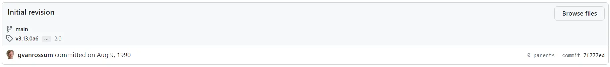
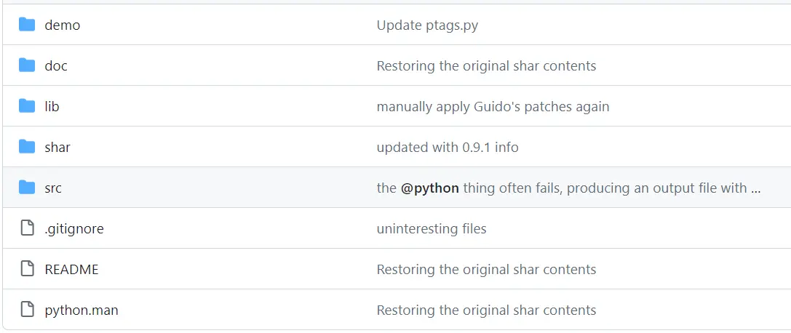
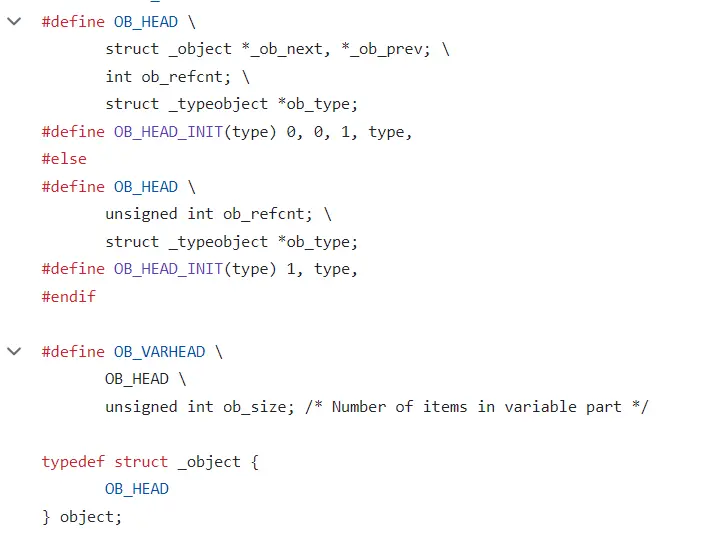
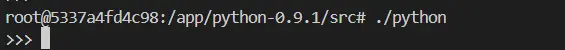
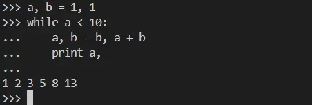
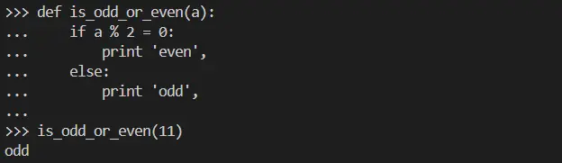

# 30年前的Python

优秀的开源项目在诞生之初总是平平无奇，甚至有些草率。然而伴随着时间的洗礼、参与者的打磨和社区的交流，这些项目终将会脱颖而出，成为软件领域的璀璨明珠。

Python就是这么一个开源项目。

最早可追溯的Python版本是1991年发布的0.9版本，是Python之父Guido放出的第一个Beta版本。再往前的版本只存在于Guido的个人电脑中，不过如今仍能通过[git日志](https://github.com/python/cpython/commit/7f777ed95a19224294949e1b4ce56bbffcb1fe9f#diff-077ca5e418241aec63a09fdda7194ec947fb3befcd59c6f848ca6e10ff681c5a)感受当初创建项目的历史瞬间。



这个id为7f777ed的初始提交只包含两个文件的修改，一个是用于构建项目的Makefile，另一个是README。这份README只有25行文字，大部分都是代建规划——

```
This directory contains the source to the Python documentation.

Unfortunately it's not not very readable, complete or up-to-date yet --
in other words, I'm still working on it!

There are four documents and a macro file:

	macros.ms		macros .so'ed by the documents

	paper.ms		conference paper about Python
	intro.ms		informal introduction to Python
	ref.ms			Python language reference manual
	modules.ms		description of standard modules

XXX There should also be a man page.

To typeset one of the documents on the default Postscript printer, chdir
to this directory (otherwise the macros aren't found!) and issue the
command

	pstroff -ms file.ms

When typesetting all documents, issue a separate command for each.

--Guido (last modified 10 Sep 90)
```

这篇README介绍了文档的阅读方式、文档内容概述和未来的规划，最后署名了作者和修改日期。可以看到当时的Guido就有非常长远的目光和超前的意识。

如今，Python持续霸榜TIOBE月度最佳编程语言，也是人工智能、数据分析、脚本运维、量化分析的最优选择。可以说Python已经渗透计算机、金融、统计、数学等各个领域的方方面面。

现在，让我们回到30年前的时光，重新领略Python的设计哲学！

## 一、语法介绍

和后续的Python1（甚至Python2）相比，Python0.9.8的语法几乎没有任何变化。但是对于习惯了Python3的我们，上手这个版本的Python还是有点别扭的。

__1.类的声明__

和后续版本不同的是类的声明需要带上括号，即使没有继承任何类——

```
class Foo():
    pass
```

__2.魔术方法__

这个版本还没有实现魔术方法，所以没有初始化函数`__init__`。通常做法是创建一个create函数然后返回self——

```
class Foo():
    def create(self):
        return self
```

__3.字符串__

只允许用单引号表示字符串——

```
str_a = 'This is a string'
```

__4.函数声明__

函数签名内的参数可以是嵌套的元组，并且在函数体内可以被正确解析——

```
def sum(a, (b, c)):
    return a + b + c

print sum(1, (2, 3)) # 6
```

这个语法应该是设计层面的Bug，因为后续版本都修复掉了。

__5. 比较__

这个版本的比较相等的符号是一个等号，和赋值符号一样，并且没有True和False等单例——

```
if a = b:
    return 1
```

__6. print语句__

print语句和Python2一样，但是可以用逗号分隔——

```
print 'hello', # 单个参数后面加个逗号也能编译通过，类似元组
```

## 二、项目结构

除了官方GitHub仓库提供的0.9.8版本，还有很多Python爱好者上传了更早的版本，比如这里有个[0.9.1版本的Python](https://github.com/erikdejonge/python-0.9.1)。



它的目录结构比官方版本更简单。除了文档手册和实例说明，实际上参与编译的只有两个文件夹，分别是lib和src。

lib目录包含了编译器自带的包，都是py文件。和今天的包不一样，那个时候的包都以脚本的形式提供。在编写Python过程中可以直接通过`import`语句导入。

src目录是Python的真正源码文件，由众多个C文件和头文件、一个Makefile和Grammar组成。和现在的cpython一样，该程序会通过Grammar生成语法分析器解析Python源码，然后再解释执行。该目录下有个`object.h`的文件是对Python对象的抽象，是现今`PyObject`的原型，说明Python在最初设计的时候就遵守了“一切皆对象”的设计原则。

另一个文件夹是shar，是Guido打包好的Python程序，一共21卷，但是第二卷缺失。



## 三、操作实践

虽然时隔30年，但是这个最初版本的Python仍然能够编译运行，这不得不感叹C语言的稳定性和兼容性。读者可以通过conda安装python0.9

```
conda install -c davidmertz python=0.9
```

也可以下载修改过的源码编译安装

```
git clone https://github.com/erikdejonge/python-0.9.1.git
cd src && make
```

读者可以访问本站Web Terminal在线运行Python 0.9.1。

[Python 0.9.1 Playground](http://43.156.106.117:8000/python-091)

> 打开页面后需要在默认目录下运行`sh start.sh`以启动Python

在命令行运行Python可以看到prompt发生变化，但是不会输出任何版本、版权信息。



尝试着写一个斐波那契数列计算，写法和今天一样也没有出错。



再写一个判断奇数偶数的方法，这里用到了Python旧版语法



关于Python诞生流传着这么一个故事，这个语言是Guido在圣诞节假期开发出来的。这个说法无从考证，但是从最初版本的Python代码质量来看绝不是一次偶然的突发奇想。现在Python又赶上了人工智能腾飞的时代，我想Python在以后版本的迭代中会更加智慧。