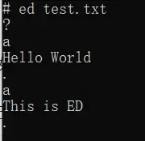

# 重现第一代Unix系统

Unix，作为世界上第一款商业操作系统在很多程序员脑海中都是传奇一般的存在。

1969年8月，刚从加州大学伯克利分校毕业的Ken Tompson在贝尔实验室敲下了构筑Unix系统的最后一行代码。他不知道这个伟大的作品影响了计算机领域后续的50年。

1974年，Unix系统在政府机关、学术机构和企业大学中流行起来。

1975年，全球有超过600台计算机运行Unix系统。

1982年，第一款商业版Unix系统发行，并催生了第一款BSD诞生。

1983年，Unix系统让Ken Tomoson获得图灵奖。

1990年，Linus受Unix启发开发了著名的Linux系统。

1996年，国际开放标准组织成立，自此Unix成为一种规范。

Unix系统自诞生以来获得的嘉奖不胜枚举，毫无疑问是计算机历史上的璀璨瑰宝。今天，让我们回到50年前荣光岁月，重现第一代Unix系统的面貌。

## 一、安装Unix系统

如今的工具和互联网让Unix安装非常简单。读者只需要准备一个Linux环境，WSL也可以。实际上，已经有计算机考古学家将Unix纸带整理成镜像放在了[GitHub](https://github.com/jserv/unix-v1)上。

根据文档要求，直接通过make构造——

```sh
git clone https://github.com/jserv/unix-v1.git
cd unix-v1
make
make run
```

这个[项目](https://github.com/simh/simh)包含一个simh项目，它整合了历史上著名的计算机裸机的虚拟机，包括VAX、PDP、ALTAIR等等。

项目启动后会看到PDP-11的字样，因为Unix系统最初是在PDP-11机器上运行的，效果图如下——


输入root即可登录Unix系统。


读者也可以访问本站web版本的Unix服务器，通过Web Terminal一睹第一代Unix的风采。

[Unix-v1 Playground](http://43.156.106.117:8000/unix-v1)

> 打开页面后需要在默认目录下运行`sh start.sh`以开启PDP-11虚拟机。

## 二、目录介绍

__根目录__

root用户登陆后直接进入根目录。通过输入ls -l可以看到当前目录的所有文件——


这个目录中包含了所有可以直接使用的命令。其中有些命令我们今天还在使用，比如cp、mv、rm和date等。其他的命令大多和磁带（或磁盘）操作有关，毕竟那个时候的机器是可以直接操作磁带上的数据的。

举个例子，rew命令是rewind的缩写，倒带的意思。那个时候的存储设备除了磁盘就是磁带，而迪吉多公司产的DECTape系列的磁带最为出名。很多如今耳熟能详的软件产品当初都是通过这个小小的磁带传输携带的，比如第一个C语言编译器等。


在命令行中输入rew就可以将这个磁带倒回某个位置重新读取数据。如果不加参数就倒回最开头起始位置，也可以指定0-7中任意位置。通过读写/dev/tap0-7文件就可以在指定位置读写数据。

另一个例子是df命令，它是disk free的缩写，用来查看磁盘的可用空间。用户可以用一个参数指定哪一个磁盘（rf0和rk0），默认所有磁盘。比如——


说明/dev/rf0和/dev/rk0磁盘的剩余空间为729和3356字节。

__dev目录__

和Linux一样，dev目录是各个设备的映射。


这个目录中涉及几类设备文件，具体内容如下——

mem是内存映射。按照Unix手册来说，它一般被用来debug系统错误，平时不会用到。

ppt是punched paper tape的缩写，即打孔纸带。最原始的记录数据的方式，现在只能在博物馆内看到了。


rf0和rk0分别是当时流行的两种磁盘RF Disk和RK05 Disk。两者都是迪吉多公司的产品，一般用于存放系统文件，所以不会轻易修改。


tape是磁带，一般是指DECTape，也是迪吉多公司的产品。dev目录内有8个tap文件，分别映射一盘磁带的8个位置。

tty是teletypewriter的缩写，即电传打字机。Unix也秉承着“一切皆文件”的哲学思想，所以打字机这种输入设备也是文件。由于那个年代还没有键盘，电传打字机是唯一输入设备。


__etc目录__

etc在英文中是等等的意思，所以存放着未被分类的文件。在后续的Linux系统中也保存着这种命名习惯，主要放一些配置文件。


在第一代Unix中，etc目录包含了以下一些文件：

as2：区别于as汇编器，它是第二次遍历汇编源码用到的汇编程序。

glob：命令行展开工具，传入第一个参数是具体的Unix命令，其余参数为该命令的参数。

init：Unix系统的初始化程序。

msh：minishell，最小的shell程序。

uids：和Linux一样，存放着用户的uid。


__tmp目录__

tmp目录存放着一些临时文件，这些文件没有文档说明，如今已经无法知道其中的意义了。


__usr目录__

该目录下存放着各个用户编写的个人文件，可以看到很多有趣的内容。


进入jack的目录可以看到有两个文件，其中`a.out`是编译后的目标文件，直接运行会打印

```
hi      2.30    10
```

不知道它是什么意思，大概是一个hello world程序。

另一个程序是`x.f`，是一个Fortran源码程序，其实就是刚刚`a.out`的源码。

```
    a = 3.2
    i = 10
    print 100, a, i
100 format(2hhi, f10.2, i5)
    end
```


不知道这位jack是谁，恐怕得问Unix开发团队了。

进入ken目录。该目录是Ken本人的目录，只有一个汇编文件`maki.s`，它是DECTape的初始化程序。


Unix中的汇编器已经支持系统调用了，由sys指令触发，比如说`sys open`是打开文件， `sys exit`是退出程序。其他的指令都源于PDP系列计算机的原生指令PAL-11R，更多可参考[官方手册](http://www.bitsavers.org/pdf/dec/pdp11/dos-batch/DEC-11-ASDB-D_PAL-11R_Assembler_Programmers_Manual_May71.pdf)。

## 三、Basic解释器

在没有Python、Ruby和Lua得年代，操作系统通常使用Basic语言作为系统得动态语言，以便处理一些简单的任务。它是微软Visual Basic的前身，其语法简单精炼，很适合业外人士使用。Unix系统中的Basic语言是一种方言，与主流Basic语言的区别可以参考用户手册。

直接在命令行中输入bas进入交互式界面。这时候界面是没有提示符的，但是已经进入Basic程序了。输入如下代码——

```
a = 0
for i = 1 10 a = a + 1
a
```


可以看到a打印出来是100，是累计叠加100次的结果。输入done可以退出程序。同样也可以在bas后面添加Basic源码执行该脚本。

第一代Unix系统中的Basic语言非常原始，只支持简单的基本语句，比如——

for语句：for name = expr expr statement

if语句：if expr statement

goto语句：goto expr

以及一些数学运算符，比如+、-、\*、/、\<、>等，以及一些简单的函数，比如sin、cos、log等。

## 四、ed行编辑器

在Linux系统下，vi/vim是查看编辑文本文件必不可少的工具。早在Unix时代，其祖先ed是非常流行的行编辑器。之所以叫行编辑器是因为它是以行为单位编辑查看的，这给当时程序开发非常繁琐。因此才有了后来的vi/vim，具体演变过程可以查看[这篇文章](https://zhuanlan.zhihu.com/p/678300924)。

新建一个文件和vim一样，直接输入ed 文件名，比如`ed test.txt`。

按回车后它会进入ed模式，但是会返回一个问号。


问号是通用错误，也就是说只要命令无法理解或者不能完成，它都返回一个问号且没有任何提示信息。这里的问号表示找不到文件。

输入"a"，表示append追加一行，这时候ed不会返回问号了。


现在输入想要输入的句子，按下回车表示换行。在换行后在输入“.”表示结束这行的输入。


如果还想输入则继续输入“a”追加内容，同样以“.”作为结束。



如果想查看输入的内容可以输入“p”，代表print。由于是行编辑器，所以只能看最后一行。


如果想显示所有内容可以给“p”指定范围，比如“1,$p”，代表从第一行到最后一行所有内容。


想要修改用命令“c”，代表change。同样需要传入一个参数表示修改的行数，否则是修改最后一行。修改完成后用“.”表示结束。


如果要删除则用命令“d”，并在前面指定行数。


这个版本的ed仍然有很多不完善的地方，比如不能显示行号，不能查找等。

从现在操作系统学科的角度来看，Unix第一代非常简陋，但是历史意义却无比重要。它的核心其实只有三个程序——sh、as和ed。正是通过这三个程序的配合构建了这个最原始的操作系统，才支撑起一门古老的计算机学科，才开创了操作系统的大航海时代。

参考资料：

unix-v1 GitHub：https://github.com/jserv/unix-v1

Unix manual：https://www.bell-labs.com/usr/dmr/www/1stEdman.html

Unix wiki：https://en.wikipedia.org/wiki/Unix

Ken Tompson wiki：https://en.wikipedia.org/wiki/Ken_Thompson

PDP-11 wiki：https://en.wikipedia.org/wiki/PDP-11

RK05 wiki：https://en.wikipedia.org/wiki/RK05

ed Youtube：https://www.youtube.com/watch?v=Zpdo6We-_e0

PAL-11R Manual：http://www.bitsavers.org/pdf/dec/pdp11/dos-batch/DEC-11-ASDB-D_PAL-11R_Assembler_Programmers_Manual_May71.pdf