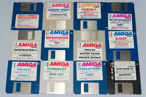
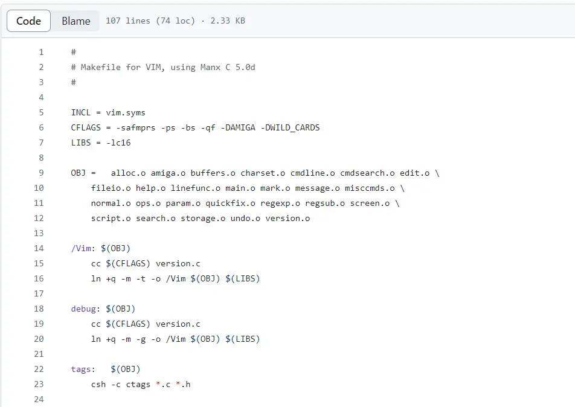

# 最古老的Vim编辑器

如果说Vi的出现是开启了命令行编辑器的“大航海时代”，那Vim绝对是获得最终大秘宝的“海贼王”。

据作者Bram Moolenaar自传回忆，最古老的Vim是于1991年发布的1.14版本。

1988年，刚从学校毕业的他从市场上购买了最先进的Amiga计算机，但是苦于没有合适的文本编辑器，便产生了自己重新造类Vi编辑器的想法。

在重造之前，Bram参考了当时兼容Amiga计算机的Stevie编辑器。Stevie编辑器是时任贝尔实验室科学家的Tim Thompson的作品，是为了响应开源运动的一个类Vi编辑器。它的全称是ST Editor for VI Enthusiasts，源码非常简单，在[官网](https://timthompson.com/tjt/stevie/)上仍然能找到。

起初Bram只是在Stevie上做修改，让它完全符合Vi的标准。随着自己需求的不断增加，他开始尝试增加一些新的内容，比如历史撤销功能。在不断的迭代下，Vim的功能越来越强大。

转机发生在1991年，Bram觉得自己的Vim编辑器使用效果不错，便萌生了发行Vim的想法。他用Fred Fish盘装了当时最新1.14版本的Vim源码，然后分享给整个社区。随即Bram很快获得了社区的积极响应，人们纷纷表示Vim对他们帮助很大，还有热心的程序员发来了补丁。

由于获得了社区的帮助，Vim1.22版本支持了Unix操作系统和MS-DOS系统，很快占领了编辑器市场。

1999年，在Linuxworld最佳编辑器投选中，Vim获得了第二。获得第一的是GNU的亲儿子Emacs。

2000年，在Slashdot Beanie最佳开源编辑器大赛中，Vim获得第一。此后也一直揽获各大奖项冠军。

在繁荣的互联网帮助下，我们还是可以在GitHub和vim.org的ftp服务器内找到当年被装在Fred Fish软盘内发行的[Vim源码](https://github.com/vim/vim-history/tree/v1.14)。

Github上这个项目是Bram亲自上传的，结构非常简单，只有一个src目录，但历史非常久远，可以追溯到33年前。

进入src目录，除了.c文件和.h文件还有一个makefile文件。在makefile中，Bram记录着如何构造这个项目。

项目采用了一种C语言的方言Manx C，以及makecmdtab。前者在互联网上已经完全找不到任何资料了，而后者是这个项目的依赖，其编译方法也无从得知。所以很遗憾，这个版本的Vim可能无法在当今环境下编译了。当然如果有Vim软盘的话还是可以在Amiga环境下运行。

虽然Amiga现在已经不生产了，但是作为复古游戏机在在某些圈子内还是热门话题。我也会在以后的文章中安排有关这台计算机的介绍。

虽然斯人已去，但是Vim对后世的影响还是非常深远。虽然我们早已习惯图形化界面带来的便利，但是大部分IDE都保留了Vim键位和操作。有关Vim的由来可以阅读之前写的[文章](https://zhuanlan.zhihu.com/p/678300924)